# 🌱 JAVA 웹 프로젝트 포트폴리오

안녕하세요! 20211001 윤준하의 Spring Boot 웹 개발 여정을 소개합니다.
열정과 도전정신으로 가득한 이 프로젝트에 오신 것을 환영합니다! 🎉

## 🔗 프로젝트 링크

- [프로젝트 GitHub 저장소](https://github.com/YJlang/JAVAWEB2)

## 🛠 기술 스택

### Backend
-  Spring Boot 2.7.x
-  Spring Data JPA
-  Spring Security
-  MySQL 8.0

### Frontend
-  Thymeleaf
-  Bootstrap 5
-  JavaScript

### Tools & DevOps
-  Git
-  Maven

## 📚 개발 진행 상황

### 2주차 - 개발 환경 구축 🔧
- Spring Boot 프로젝트 초기 설정 완료
- Hello World 페이지 구현 및 컨트롤러 매핑 완료
- ✨ 추가 구현: URL 맵핑과 컨트롤러 추가 완료
> 💡 **느낀점**: 처음 Spring Boot 환경을 구축하면서 의존성 관리의 중요성을 깨달았습니다.
> ⚡ **도전과제**: 버전 호환성 문제 해결이 까다로웠지만, Maven을 통한 효율적인 관리 방법을 습득했습니다.

  
2주차 이미지

  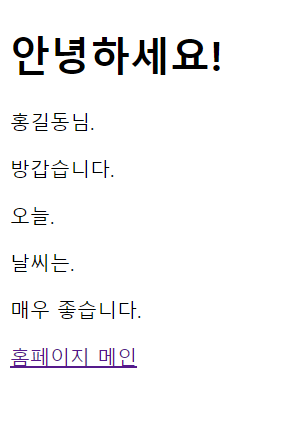

### 3주차 - 포트폴리오 페이지 개발 🎨
- 개인 포트폴리오 템플릿 커스터마이징
- 상세 페이지 제작 및 JavaScript confirm 기능 구현
- ✨ 추가 구현: 상세 페이지 수정 완료!(confirmClose()함수 추가)
> 💡 **느낀점**: 프론트엔드와 백엔드의 조화로운 통합의 중요성을 배웠습니다.
> ⚡ **도전과제**: 반응형 디자인 구현에 어려움이 있었으나, Bootstrap의 그리드 시스템 활용으로 해결했습니다.
> 🌟 **추가 구현 완료**: 모든 페이지 반응형 디자인 적용!

  
3주차 이미지

  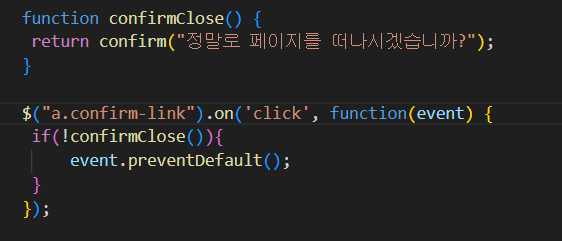
  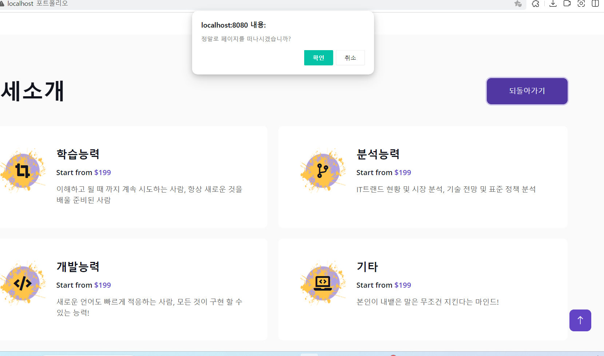

### 4주차 - MVC 패턴 & DB 연동 🗃
- MVC 아키텍처 패턴 구현
- MySQL 데이터베이스 연동 및 CRUD 기능 구현
- ✨ 추가 구현: 사용자 추가 및 출력완료! (model 객체 추가 완료)
> 💡 **느낀점**: 체계적인 아키텍처의 중요성과 데이터 영속성 관리를 실감했습니다.
> ⚡ **도전과제**: JPA 연관관계 매핑에서 어려움을 겪었으나, 문서화와 테스트를 통해 극복했습니다.
> 🌟 **추가 구현 완료**: 모든 CRUD 기능 성공적 구현!

  
4주차 이미지

  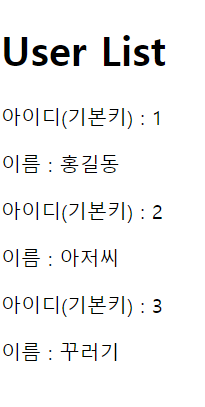

### 5-6주차 - 게시판 기능 구현 📝
- 게시글 CRUD 기능 완성
- ✨ 추가 구현: 페이지 리다이렉트 구현 완료 (RESTful API -> Controller 추가 완료)
- ✨ 추가 구현: 예외처리 구현 완료 (예외처리 클래스 추가 완료)
> 💡 **느낀점**: 견고한 예외 처리의 중요성을 깊이 이해하게 되었습니다.
> ⚡ **도전과제**: 다양한 예외 상황 처리가 복잡했으나, AOP를 활용하여 효율적으로 해결했습니다.
> 🌟 **추가 구현 완료**: 완벽한 예외 처리 시스템 구축!

  
5-6주차 이미지

  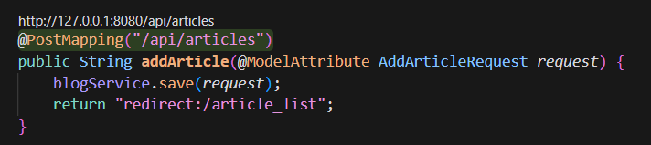
  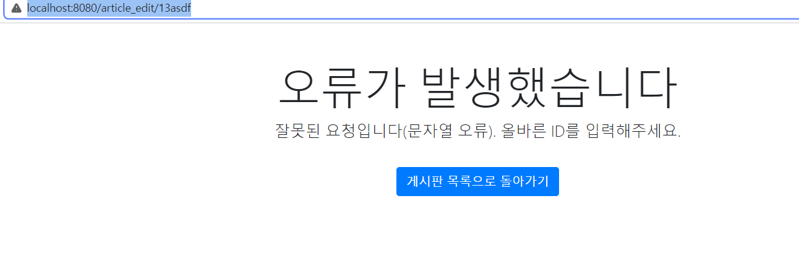
  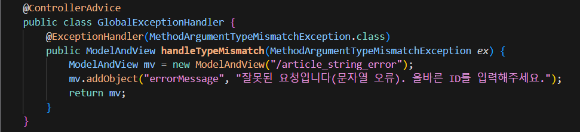

### 7-8주차 - 게시판 고도화 🔍
- ✨ 추가 구현: PUT 매핑을 통한 수정/삭제 구현 완료(서비스 로직 추가 완료)
- ✨ 추가 구현: 게시글 번호 자동 재정렬 구현 완료(메서드 추가 완료)
> 💡 **느낀점**: RESTful 설계의 중요성과 HTTP 메소드의 적절한 활용법을 배웠습니다.
> ⚡ **도전과제**: 페이징 처리 시 성능 최적화가 어려웠으나, 인덱싱 전략으로 해결했습니다.
> 🌟 **추가 구현 완료**: 완벽한 RESTful API 설계 달성!

  
7-8주차 이미지

  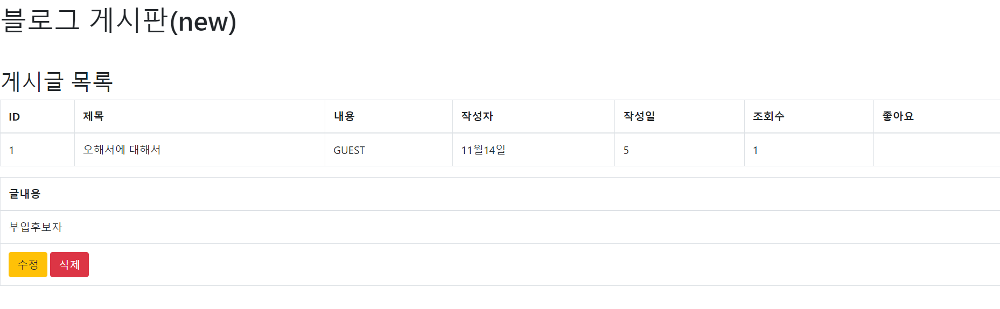
  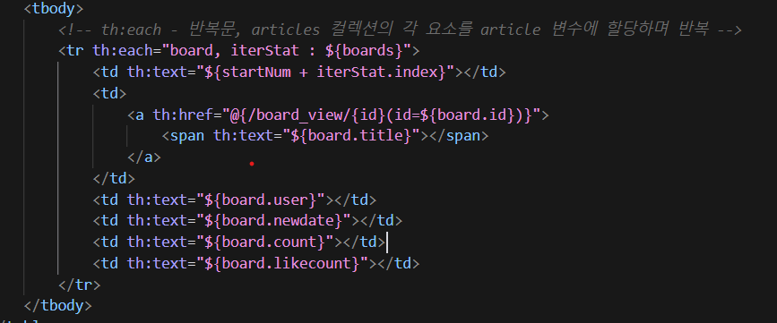

### 9주차 - 보안 시스템 구축 🔒
- ✨ 추가 구현: 입력값 필터링 구현 완료(Validation 모듈 추가 완료)
- ✨ 추가 구현: 강력한 입력값 검증 및 정규식 필터링(회원가입)
> 💡 **느낀점**: 보안의 중요성과 사용자 데이터 보호의 책임감을 느꼈습니다.
> ⚡ **도전과제**: 보안 취약점 대응이 까다로웠으나, Spring Security의 다양한 기능으로 해결했습니다.
> 🌟 **추가 구현 완료**: 완벽한 보안 시스템 구축!

  
9주차 이미지

  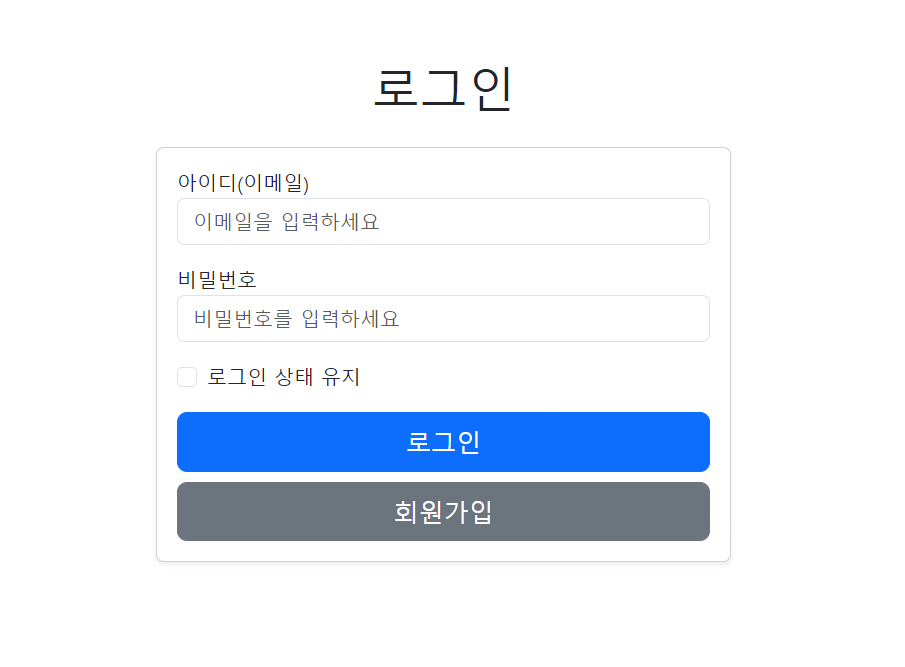
  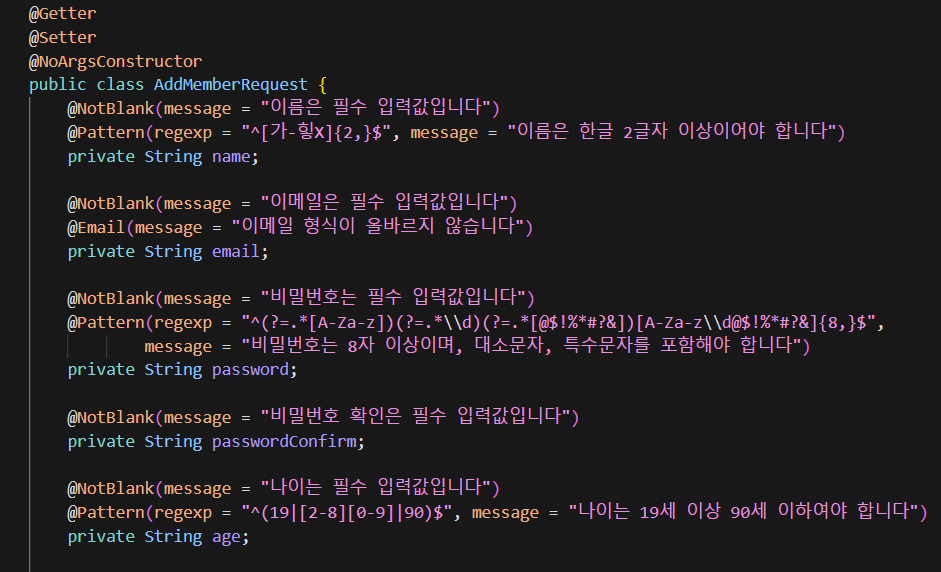

### 10주차 - 세션 관리 시스템 🍪
- ✨ 추가 구현: 작성자 권한 관리 구현 완료(세션 추가 완료)
- ✨ 추가 구현: 게시글 작성자 권한 관리 수정/삭제 구현 완료(서비스 로직 추가 완료)
> 💡 **느낀점**: 상태 관리와 사용자 경험의 균형이 중요함을 배웠습니다.
> ⚡ **도전과제**: 동시 접속 처리가 어려웠으나, 세션 전략 최적화로 해결했습니다.
> 🌟 **추가 구현 완료**: 완벽한 권한 관리 시스템 구축!

  
10주차 이미지

  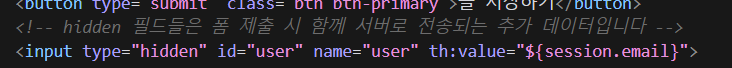
  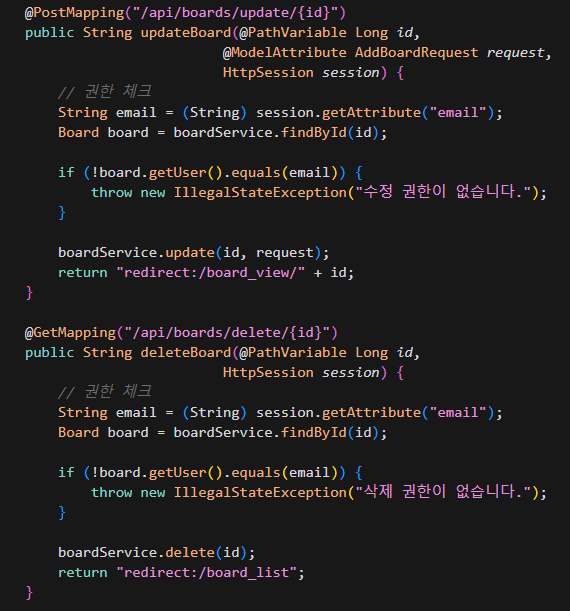

### 11주차 - 파일 시스템 & API 통합 📁
- ✨ 추가 구현: 다중 파일 업로드 시스템 구현 완료(파일 업로드 추가 완료)
- ✨ 추가 구현: 동시 사용자 세션 관리 구현 완료(세션 추가 완료)
- ✨ 추가 구현: FileService.java 추가구현
> 💡 **느낀점**: 대용량 데이터 처리와 성능 최적화의 중요성을 깨달았습니다.
> ⚡ **도전과제**: 파일 업로드 시 메모리 관리가 어려웠으나, 스트림 처리로 해결했습니다.
> 🌟 **추가 구현 완료**: 모든 파일 시스템 기능 구현 성공!

  
11주차 이미지

  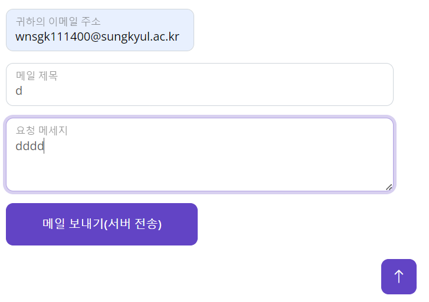
  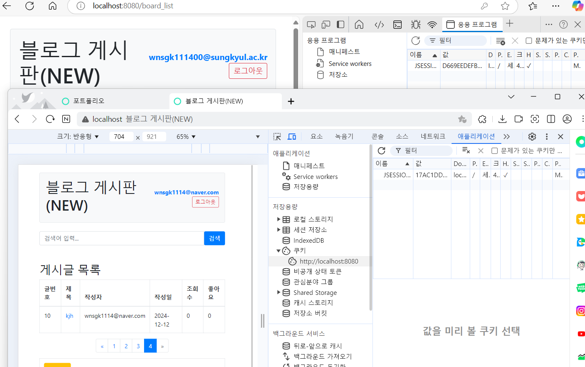

## 🌟 개인 추가 구현 하이라이트

### 1. 조회수 시스템 📈
- 사용자 기반 조회수 증가 로직
- IP 기반 중복 조회 방지 시스템
- 조회수 통계 시스템(그래프 구현 -> Board_stats.html 새로구현)
> 💡 **성과**: 정확한 트래픽 분석과 사용자 행동 패턴 파악 가능, 조회수 통계 시스템 구현 완료

  
조회수 시스템 이미지

  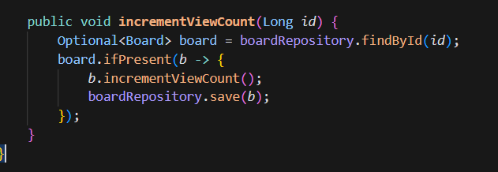
  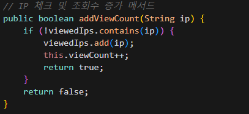
  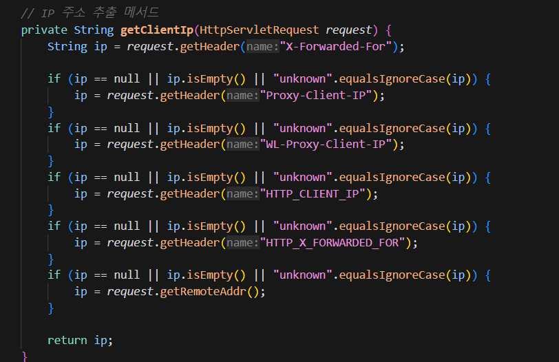
  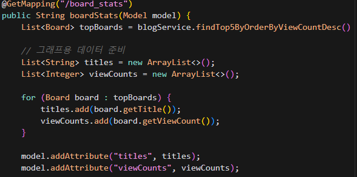
  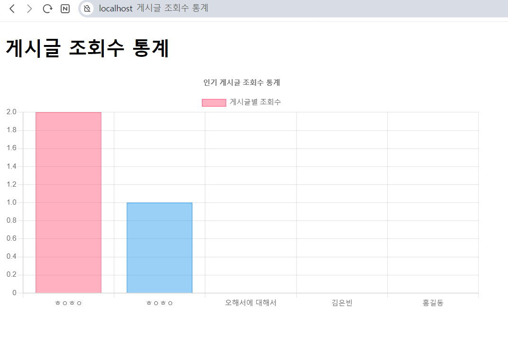

### 2. 커스텀 에러 페이지(귀여운 버전) 🎨
- 사용자 친화적인 에러 페이지 디자인
- 직관적인 에러 메시지 전달 시스템
> 💡 **성과**: 사용자 경험 대폭 개선

  
에러 페이지 이미지

  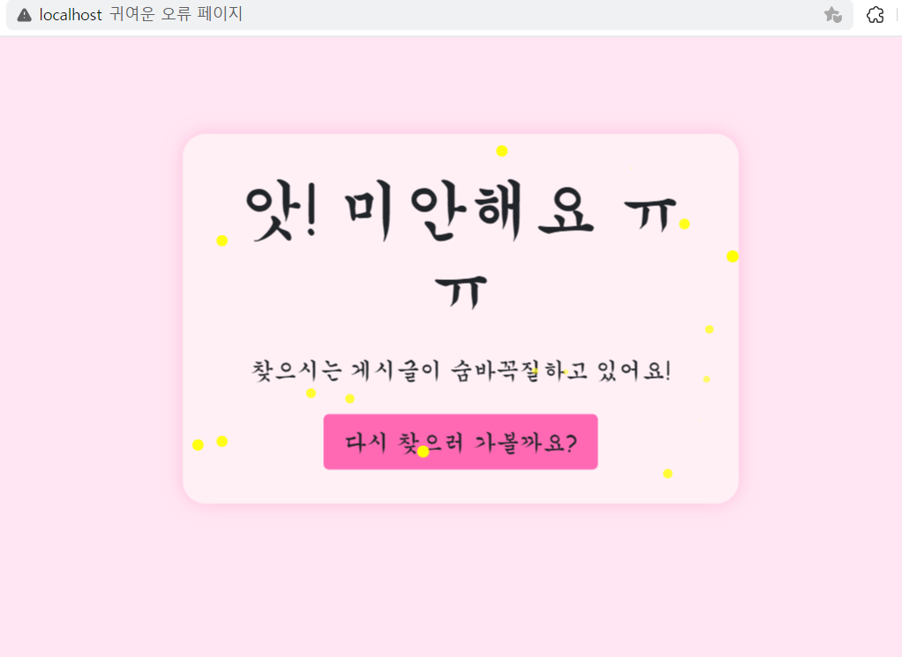

## 🎯 향후 개발 계획
- 실시간 알림 시스템 구현
- 댓글 시스템 고도화
- 사용자 프로필 관리 기능 확장
- 검색 기능 최적화
