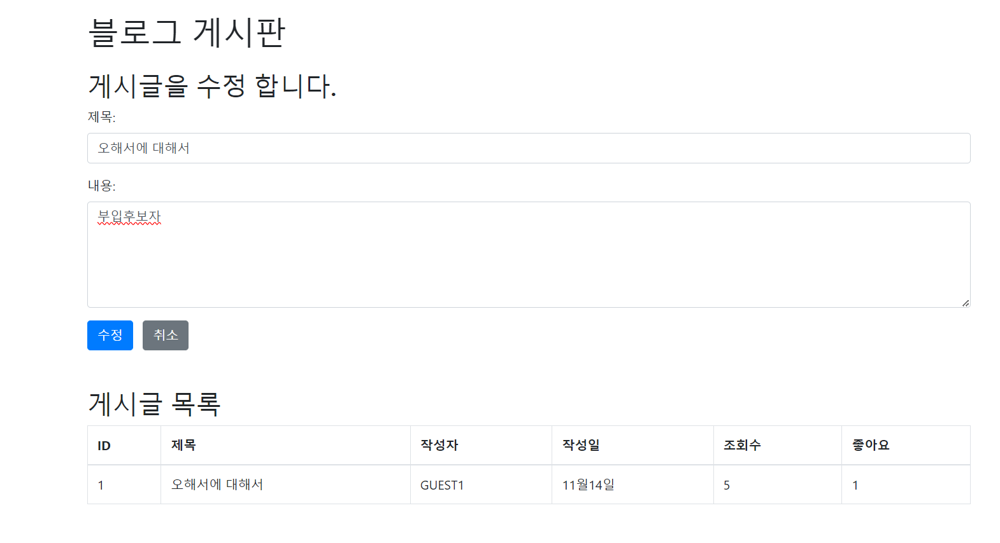

# 🌱 SPRING BOOT 웹 서비스 개발 프로젝트

> 2023년 윤준하의 새로운 도전! Spring Boot를 활용한 웹 서비스 개발 여정을 기록합니다.

## 📌 프로젝트 소개

본 프로젝트는 Spring Boot 기반의 웹 애플리케이션 개발 과정을 담고 있습니다.

## 🛠️ 기술 스택

  
  
  
  

## 📝 개발 진행 상황

### Week 2 - 개발 환경 구축 ⚙️
- Spring Boot 환경 설정 및 초기 테스트
- hello2.html 페이지 구현 및 컨트롤러 매핑

📸 구현 결과

### Week 3 - 포트폴리오 페이지 개발 🎨
- 개인 포트폴리오 템플릿 커스터마이징
- 상세 페이지 제작 및 알림창 구현

📸 구현 결과

### Week 4 - 데이터베이스 연동 🗄️
- MVC 패턴 학습 및 구현
- MySQL 데이터베이스 연동 및 CRUD 구현

📸 구현 결과

### Week 5-6 - 게시판 기능 구현 📊
- 게시글 작성 및 조회 기능
- 수정/삭제 기능 및 예외처리

📸 구현 결과

### Week 7-8 - 게시판 고도화 🔄
- 게시글 CRUD 완성
- 페이징 처리 및 검색 기능 구현

📸 구현 결과

### Week 9-10 - 사용자 인증 시스템 🔐
- 회원가입/로그인 기능 구현
- 비밀번호 암호화 및 입력값 검증
- 세션 관리 및 쿠키 설정

📸 구현 결과

### Week 11 - 파일 업로드 & API 연동 🗂️
- 다중 파일 업로드 시스템 구현
- Google Maps API 연동
- 동시 접속 사용자 관리 시스템 구현

📸 구현 결과

## ✨ 추가 구현 기능

### 1. 조회수 시스템
- 사용자별 조회수 증가 로직 구현
- 중복 조회 방지 시스템

### 2. 커스텀 에러 페이지
- 사용자 친화적인 에러 페이지 디자인

📸 에러 페이지 미리보기

### 3. 게시글 기능 강화
- 실시간 날짜 표시 시스템
- 좋아요/싫어요 기능 구현
